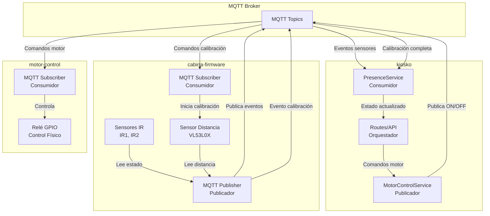
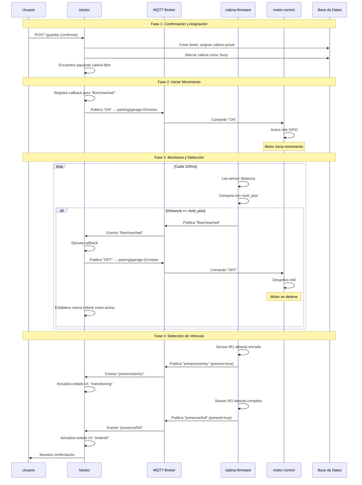
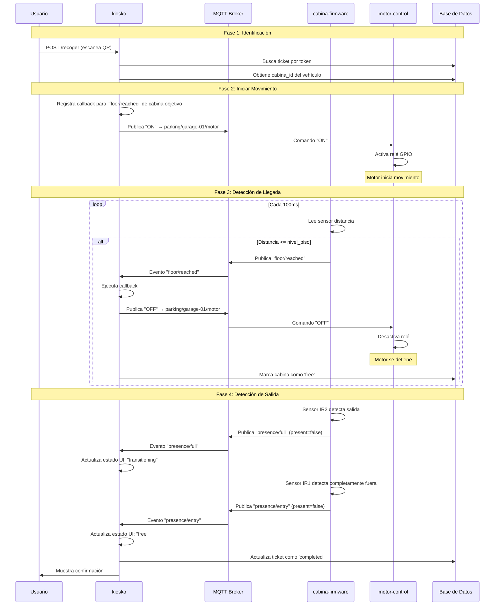
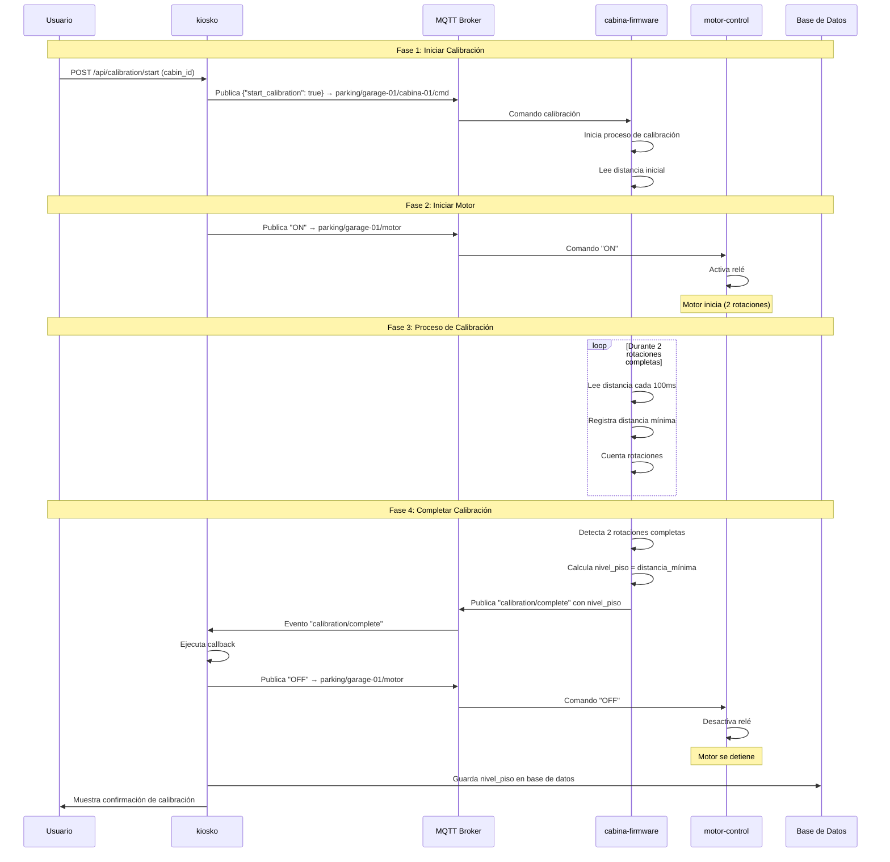
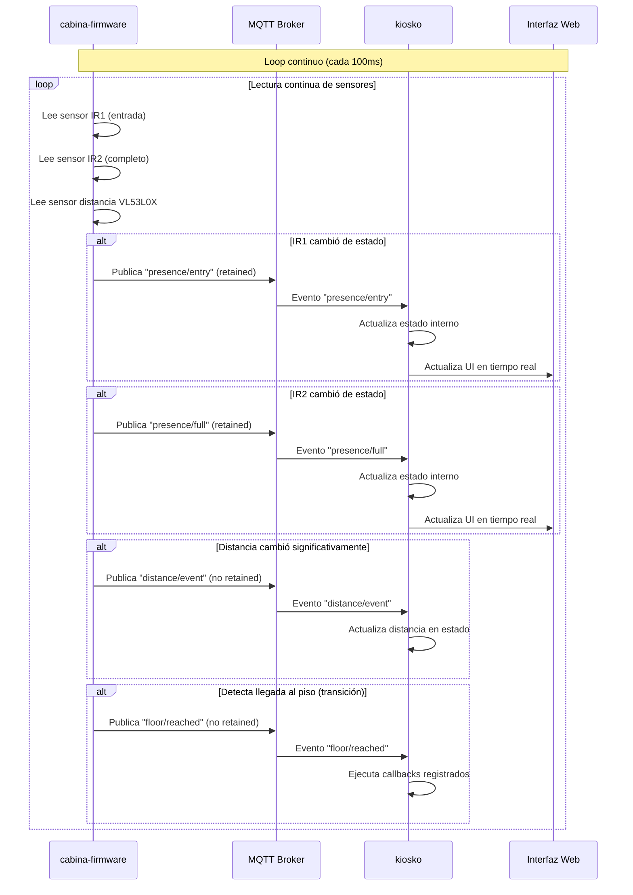
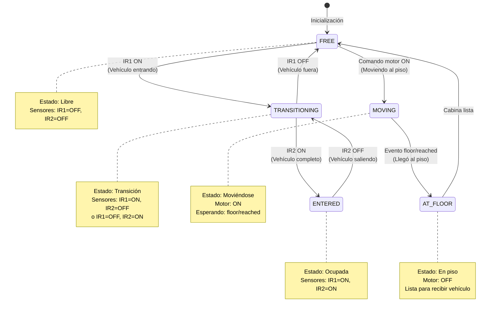
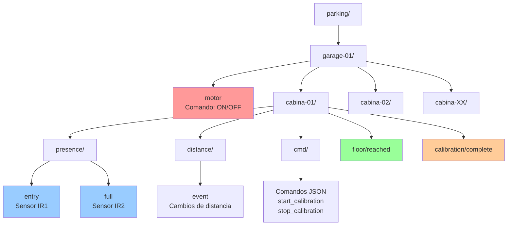
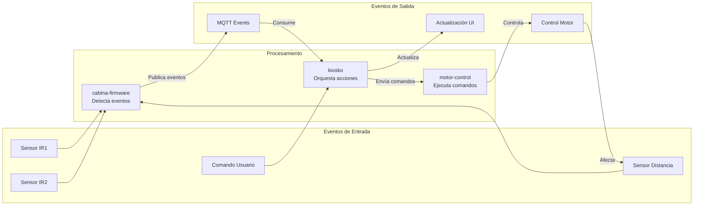

# Diagrama de Eventos - Sistema de Estacionamiento Vertical

Este documento contiene diagramas Mermaid que visualizan el flujo de eventos en el sistema basado en eventos.

---

## 1. Diagrama General de Arquitectura de Eventos

---

## 2. Flujo: Almacenamiento de Vehículo

---

## 3. Flujo: Recuperación de Vehículo

---

## 4. Flujo: Calibración del Sistema

---

## 5. Flujo: Detección Continua de Sensores

---

## 6. Diagrama de Estados de una Cabina

---

## 7. Diagrama de Topics MQTT

---

## 8. Flujo de Eventos: Vista de Alto Nivel

---

## Notas sobre los Diagramas

1. **Asincronía**: Todos los eventos son asíncronos - no hay bloqueo entre módulos
2. **MQTT como intermediario**: Todos los eventos pasan por el broker MQTT
3. **Callbacks**: kiosko usa callbacks para reaccionar a eventos específicos
4. **Retención**: Algunos eventos son retenidos (presence), otros no (floor/reached)
5. **Loop continuo**: cabina-firmware lee sensores continuamente y publica eventos

Estos diagramas muestran cómo el sistema funciona completamente basado en eventos, sin comunicación directa entre módulos.
